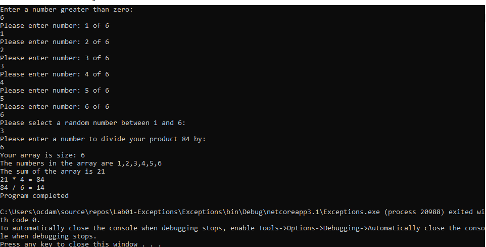

# Lab01-Exceptions
First C# lab about exception handling and debugging  

To get set up to run this application, you must first have visual studio installed.  
Once installed, using a terminal of your choosing, you can clone down the repository to your local machine.  
Then run the command:
    start Lab01-Exceptions  

This should start up visual studio with this program, then you can hit the little debug tab at the top, and choose either "start debugging" or "start without debugging".  

